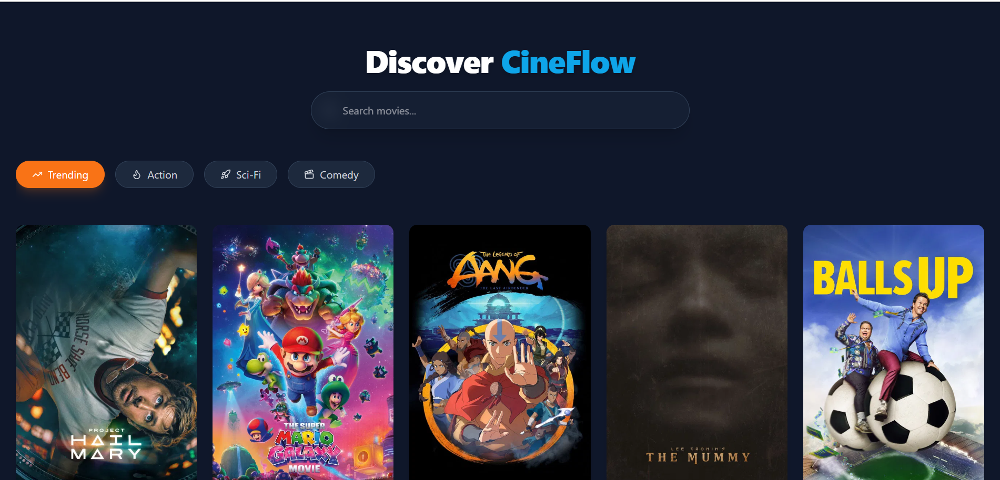
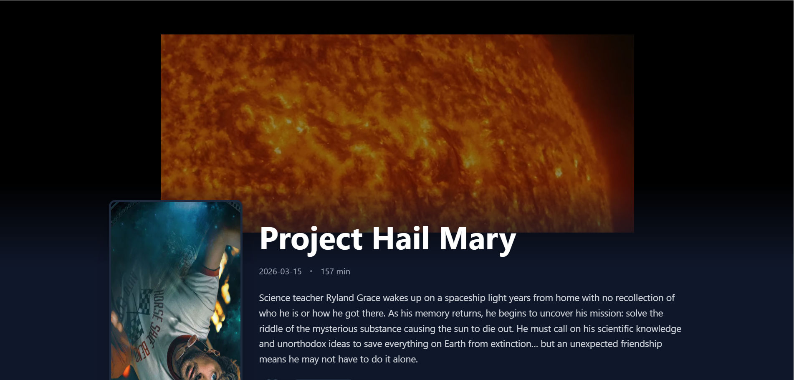
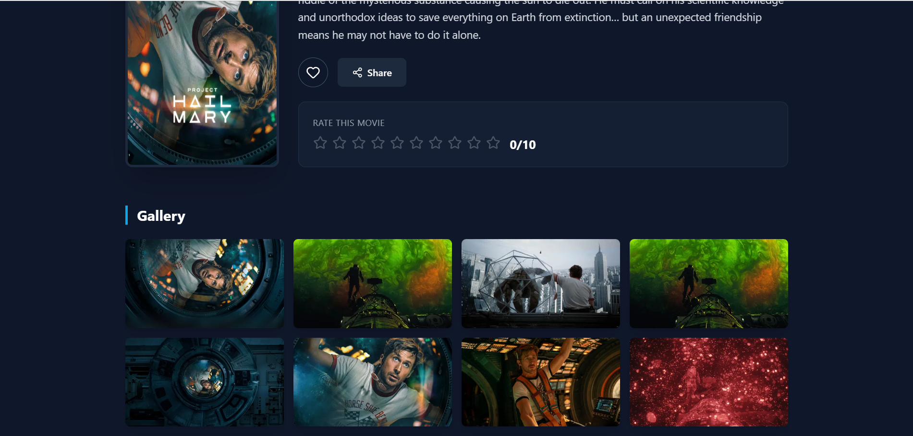

# 🎬 CineFlow


*A modern, highly responsive cinematic movie discovery hub built with the latest React ecosystem.*

[]()
[]()
[]()
[]()

CineFlow is a "Netflix-style" application designed to provide a seamless and visually stunning movie browsing experience. It leverages the TMDB API for rich data, features advanced mutual-exclusion filtering, and persists user preferences locally.

---

## ✨ Key Features

* **Cinematic UI/UX:** Dark-themed aesthetics (#0f172a) with glassmorphism overlays and smooth hover scaling.
* **Smart Discovery:** Mutual exclusion logic ensures a clean experience—searching clears category tabs, and clicking tabs clears the search.
* **Immersive Details:** Auto-playing, muted YouTube trailer backgrounds on movie detail pages.
* **Dynamic Masonry Gallery:** CSS-only masonry layouts for movie stills using Tailwind v4 `columns`.
* **Persistent User State:** `Zustand` with `persist` middleware ensures your "Favorites" list and custom movie ratings survive page refreshes.
* **Native Sharing:** Integrated Web Share API for mobile-friendly link sharing.

---

## 📸 Screenshots

### The Discovery Hub
*Showcase the hero search, category tabs, and movie grid with glassmorphism hover states.*


### Cinematic Details
*Showcase the auto-playing trailer background, movie metadata, and masonry photo gallery.*


---

## 🛠️ Tech Stack

* **Frontend Framework:** React (Functional Components)
* **Build Tool:** Vite
* **Styling:** Tailwind CSS v4 (Using the new CSS-variable `@theme` architecture)
* **State Management:** Zustand (with LocalStorage persistence)
* **Routing:** React Router v7
* **Icons:** Lucide-React
* **Data Fetching:** Axios + TMDB API

---

## 🚀 Getting Started

### Prerequisites
You will need Node.js installed and a free API key from [The Movie Database (TMDB)](https://developer.themoviedb.org/docs).

### Installation

1. **Clone the repository**
   ```bash
   git clone [https://github.com/Abdi_404/cineflow.git](https://github.com/Abdi_404/cineflow.git)
   cd cineflow
2. **Install dependencies**
   ```bash
   npm install
3. **Set up Environment Variables**
  
   Create a .env file in the root directory and add your TMDB API key:
      ```bash
      VITE_TMDB_API_KEY=your_api_key_here

    
 (Note: Remember to update your `src/api/tmdb.js` file to use `import.meta.env.VITE_TMDB_API_KEY`         instead of a hardcoded string).


4. **Run the development server**
    ```bash
    npm run dev

---

## 📂 Project Structure
    
    src/
    ├── api/
    │   └── tmdb.js             # Axios instance and TMDB endpoints
    ├── pages/
    │   ├── Home.jsx            # Main discovery grid and search
    │   └── MovieDetails.jsx    # Individual movie view with trailer/gallery
    ├── store/
    │   └── useMovieStore.js    # Zustand store (Favorites, Ratings, Search/Genre state)
    ├── App.jsx                 # React Router setup
    ├── index.css               # Global Tailwind v4 configuration
    └── main.jsx                # React root

## 🔮 Future Enhancements (Roadmap)
  * [ ] Implement user authentication via Firebase.

  * [ ] Create a dedicated "My Library" page to view all favorited movies.

  * [ ] Add Infinite Scrolling for the movie grid.

  * [ ] Support TV Shows alongside movies.

### 👨‍💻 Author
 **Eng Abdijabaar**
  * GitHub: @eng-Abdijabaar

    
 Designed and engineered with a focus on modern web standards and responsive aesthetics.
